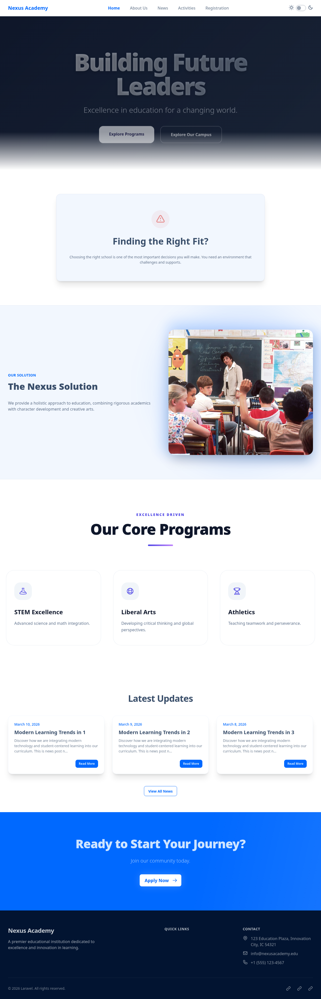
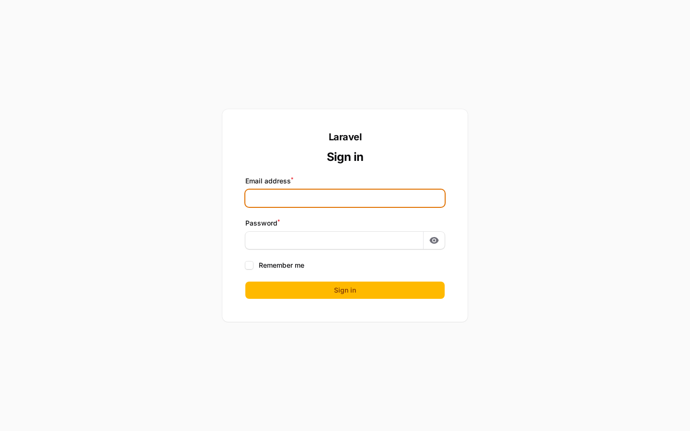
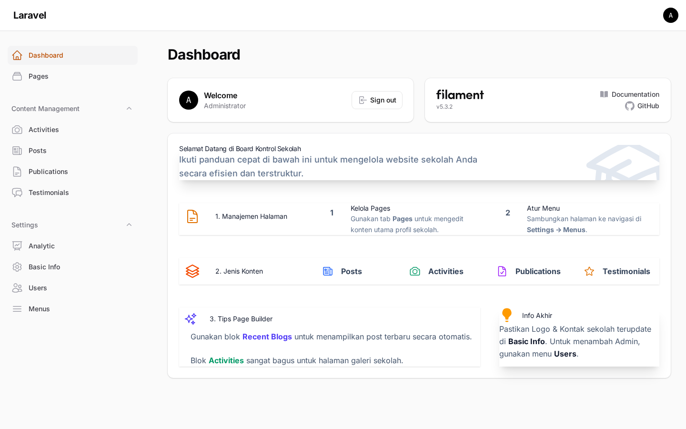
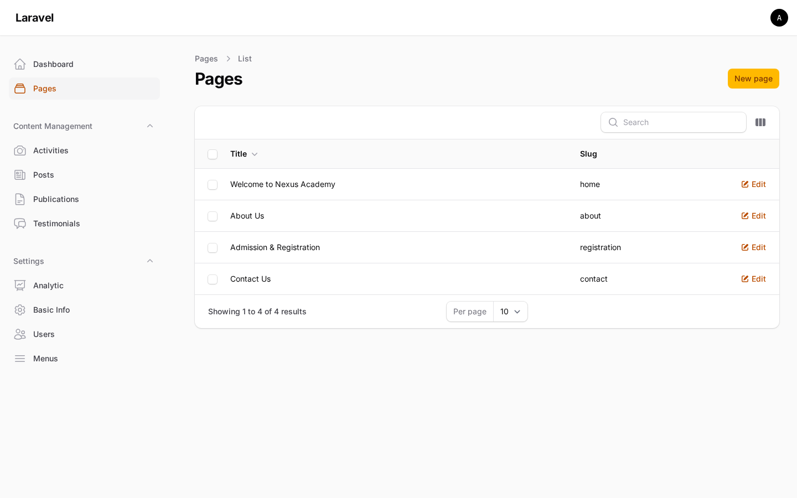
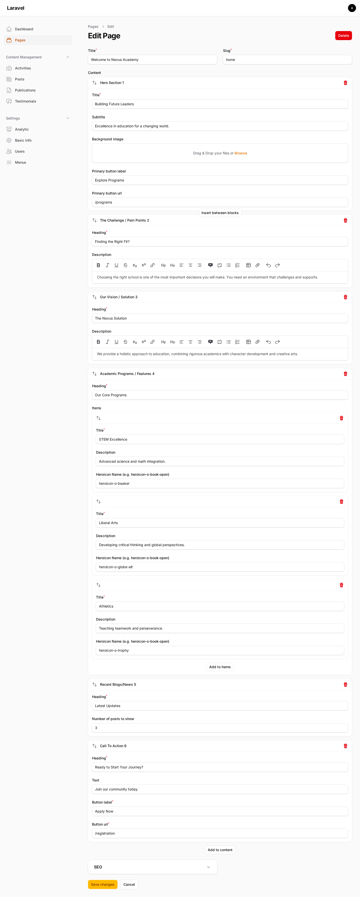
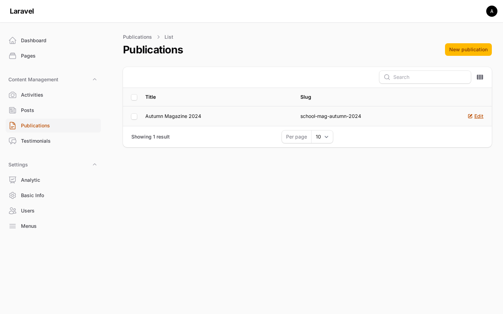
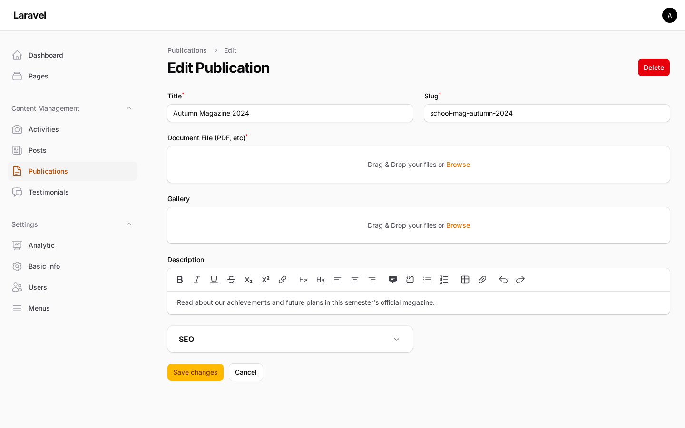
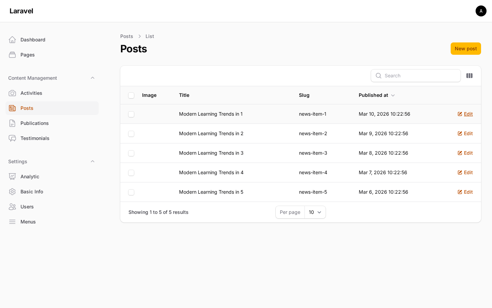
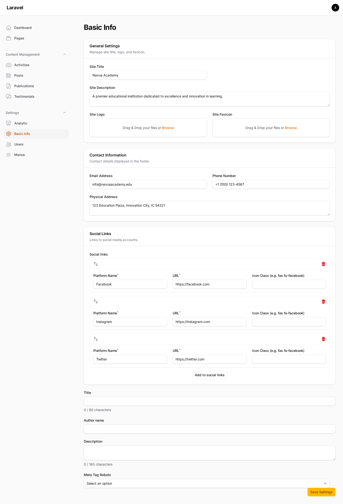

# 🏫 School Profile - Filament PHP

A sophisticated and modern school profile management system built with **Laravel 12**, **Filament PHP v3**, and **DaisyUI**. This project provides a robust administrative interface for managing every aspect of a school's digital presence, from dynamic page layouts to SEO and Google Analytics.

---

## ✨ Features

### 🛠 Administrative Dashboard (Filament PHP)
*   **Intuitive UI**: A clean, modern admin interface built on Filament v3.
*   **Comprehensive CMS**: Manage all site content including:
    *   **Pages**: Create dynamic pages with a modular block builder.
    *   **Posts & News**: Full-featured blog management.
    *   **Activities**: Track and display school events and activities.
    *   **Publications**: Manage school documents, reports, and digital publications.
    *   **Testimonials**: Curate feedback from students, parents, and alumni.
*   **Role-Based Access**: Secure authentication and user management.
*   **Admin Guide**: Built-in widget providing quick tips for administrators.
*   **Notifications**: Real-time notification system for system events.

### 🏗 Dynamic Page Builder
Build complex, responsive page layouts without writing code using our pre-built blocks:
*   **Hero Sections**: Stunning first impressions with images and CTAs.
*   **Contextual Blocks**: Challenge/Pain Points and Vision/Solution layouts.
*   **Programs & Features**: Grid-based displays with Heroicon support.
*   **Dynamic Lists**: Automatically pull latest Posts, Activities, or Publications into any page.
*   **FAQ & Testimonials**: Static or dynamic feedback sections.
*   **Call to Action (CTA)**: High-conversion segments for registration or contact.

### ⚙️ Site Management
*   **Menu Builder**: Drag-and-drop management for Header and Footer navigation menus.
*   **General Settings**: Control site branding, contact info, and layout defaults.
*   **SEO Suite**: Integrated SEO meta management (titles, descriptions, social images) for every page and post.
*   **Google Analytics**: Dedicated settings panel to configure GA4 tracking with real-time dashboard widgets.

### 🎨 Frontend Excellence
*   **DaisyUI & Tailwind CSS**: Professional, utility-first design system.
*   **Theme Switcher**: Supported themes including `Winter` (light) and `Dim` (dark).
*   **Responsive Design**: Fully optimized for mobile, tablet, and desktop views.

---

## 🎨 Frontend Customization Guide

### 1. Customize Theme (Global Styles)
Theme and fonts are configured in `resources/css/app.css`:

- **DaisyUI themes** live in the `@plugin "daisyui"` block.
- **Fonts** live in the `@theme` block.
- **Active theme** can also be set on the `<html>` tag via `data-theme` in `resources/views/layouts/app.blade.php`.
- **Theme toggle** is wired via an `<input type="checkbox" class="theme-controller">` in `resources/views/partials/header.blade.php`.
To switch themes, update both the `data-theme` on `<html>` and the toggle state/class in the header so they stay in sync.

Example:
```css
@plugin "daisyui" {
    themes: winter --default, dim --prefersdark;
}

@theme {
    --font-sans: 'Instrument Sans', ui-sans-serif, system-ui, sans-serif;
}
```

To switch the default theme, change `--default` or add/remove themes in that list.

### 2. Customize Header / Footer
The layout pulls these partials:
- Header: `resources/views/partials/header.blade.php`
- Footer: `resources/views/partials/footer.blade.php`
- Layout wrapper: `resources/views/layouts/app.blade.php`

These use DaisyUI + Tailwind classes, so you can safely change markup, layout, and class names there.

### 3. Customize Existing Blocks
Each page-builder block is a Blade partial in:
- `resources/views/blocks/*.blade.php`

The block data shape is defined in:
- `app/Filament/Resources/Pages/Schemas/PageForm.php`

Workflow to customize:
1. Update the markup/classes in the block file you want.
2. If you change fields, update the block schema in `app/Filament/Resources/Pages/Schemas/PageForm.php` so the editor matches the view.

For static pages and detail views (e.g., activities, posts), templates live in:
- `resources/views/pages/**`

### 4. Add a New Block (Page Builder)
1. Add a new block schema in `app/Filament/Resources/Pages/Schemas/PageForm.php`.
2. Create a matching view in `resources/views/blocks/<your_block>.blade.php`.
3. Use the `$data` array inside the Blade file for fields you define in the schema.
4. The page renderer automatically includes the block by type via `resources/views/page.blade.php`, so no extra wiring is required.

### 5. Tips: Import Tailwind/DaisyUI Templates (IDE AI)
1. Create a hidden templates folder: `resources/views/.template/`
2. Paste the new template HTML there as a reference file.
3. Use an IDE AI prompt like:

```
Adapt the design from resources/views/.template/<file>.blade.php
to the existing frontend views in resources/views/**,
but do not change anything in resources/views/filament/**.
Keep existing Blade variables and loops working.
```

---

## 🛠 Tech Stack

| Layer | Technology |
| :--- | :--- |
| **Framework** | [Laravel 12](https://laravel.com/) |
| **Admin Panel** | [Filament PHP v3](https://filamentphp.com/) |
| **UI Components** | [DaisyUI](https://daisyui.com/) & [Tailwind CSS](https://tailwindcss.com/) |
| **Icons** | [Heroicons](https://heroicons.com/) |
| **SEO** | [Laravel Filament SEO](https://github.com/ralphjsmit/laravel-filament-seo) |
| **Analytics** | [Filament Google Analytics](https://github.com/bezhansalleh/filament-google-analytics) |
| **Database** | SQLite (Default) |

---

## 🚀 Getting Started

### 1. Prerequisites
*   **PHP 8.2+**
*   **Composer**
*   **Node.js & NPM**
*   **SQLite** (or your preferred database)

### 2. Installation

1.  **Clone the repository**:
    ```bash
    git clone <repository-url>
    cd smp-filament
    ```

2.  **Install dependencies**:
    ```bash
    composer install
    npm install
    ```

3.  **Configure Environment**:
    ```bash
    cp .env.example .env
    php artisan key:generate
    ```

4.  **Initialize Database**:
    ```bash
    # This creates the database, runs migrations, and seeds sample data
    php artisan migrate --seed
    ```

5.  **Setup Storage**:
    ```bash
    php artisan storage:link
    ```

### 3. Running Locally

Start the development servers in separate terminals:

```bash
# Terminal 1: PHP Server
php artisan serve

# Terminal 2: Vite (CSS/JS)
npm run dev
```

Visit the application at: `http://127.0.0.1:8000`
Access the Admin Panel: `http://127.0.0.1:8000/admin`

---

## 🔐 Default Admin Access
If you ran the seeder, use these credentials:
*   **Email**: `admin@admin.com`
*   **Password**: `password`

---

## 🧪 Testing

### Pest (Feature Tests)
```bash
php artisan test
```

### Browser E2E (Playwright)
```bash
npm install
npx playwright install
php artisan key:generate --env=e2e
php artisan migrate:fresh --seed --env=e2e
npm run e2e
```

Notes:
- E2E server runs on `http://127.0.0.1:8001` via `.env.e2e` and `npm run e2e`.
- Server logs are redirected to `/tmp/e2e-server.log`.

---

## 📸 Screenshots

### 🌐 Frontend


### 🔐 Admin Panel
| Login Page | Dashboard |
| :---: | :---: |
|  |  |

| Pages Management | Page Edit |
| :---: | :---: |
|  |  |

| Publications | Publication Edit |
| :---: | :---: |
|  |  |

| Blog Posts | Settings |
| :---: | :---: |
|  |  |

---

Developed with ❤️ for educational excellence.
